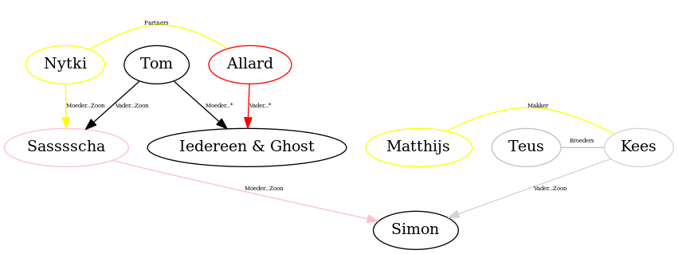
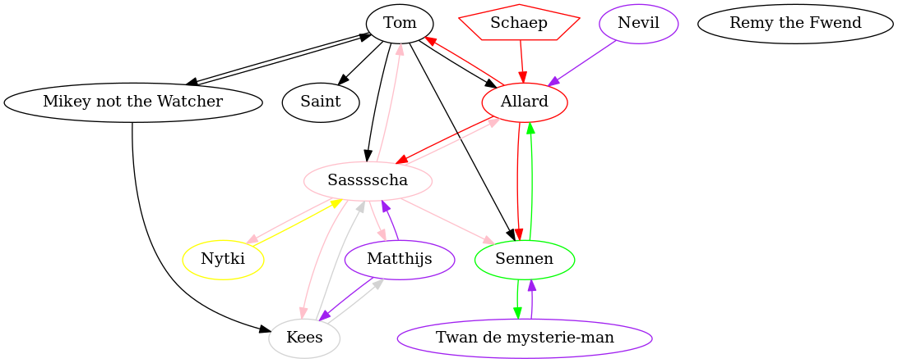

# Graphs.dot
Our graphs! In the middle of the street.

## Quicklinks

 - [Family Graph](#family-graph)
 - [Ships Graph](#ships-graph)
 
## Contributing

### What
This is a collection of graphs, written in [DOT](https://en.wikipedia.org/wiki/DOT_(graph_description_language)). 
Further info on DOT can be found here:

 - [Small guide to using DOT](https://www.graphviz.org/pdf/dotguide.pdf)
 - [Language Specification](https://www.graphviz.org/doc/info/lang.html) (for the technically inclined)

Using GitHub Actions DOT files within the graphs directory in this repository are automatically converted into PNG's which are placed in the images directory. 

### How

Contributing is easy! Feel free to open a pull request with file changes. If you don't know how to, GitHub has a range of helpful guides on how to create pull requests, and don't feel afraid to ask the maintainers of the repository for help if needed.

## Family Graph

## Ships Graph

